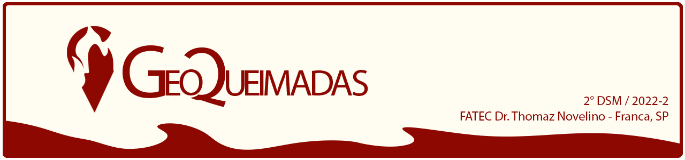

 

 

    <a href="#sobre">Sobre</a>  |     
    <a href="#final">Apresentação Final</a>

## :bookmark_tabs: Sobre o projeto

A partir do desafio proposto do projeto interdisciplinar no 2º semestre do curso Desenvolvimento de Software Multiplataforma da Fatec Franca de construir um site, com o intuito de solucionar um problema de algum tema dos 17 objetivos de desenvolvimento sustentável da ONU, nosso grupo desenvolveu um site voltado para um sistema de controle de queimadas, onde o usuário poderá enviar no site locais que estão tendo queimadas em tal momento, e o sistema irá redirecionar tais endereços para os órgãos responsáveis ao combate de queimadas.

:pushpin: Status do Projeto: 🚧: **Em andamento** 🚧

→ [Voltar ao topo](#topo)

## :clapper: Apresentação Final do Projeto :clapper:
    
🚧: **Em andamento** 🚧
    

## Referência

 - [INSTITUTO NACIONAL DE PESQUISAS ESPACIAIS](https://queimadas.dgi.inpe.br/queimadas/portal)
 
 ### APIs
 - [ViaCEP](https://viacep.com.br/)

→ [Voltar ao topo](#topo)
